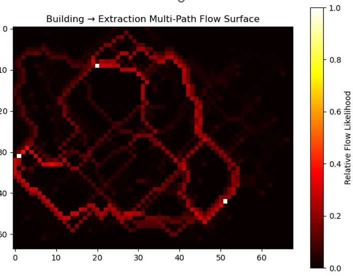
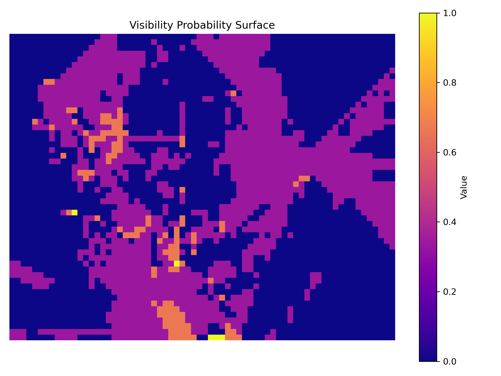
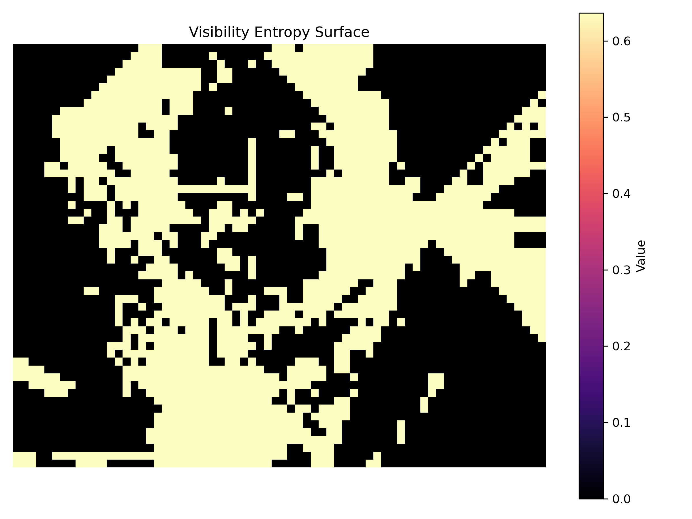
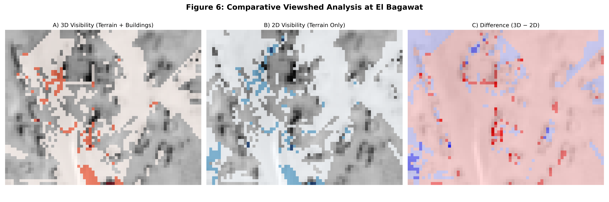

# LAMP Project  
## Computational Reconstruction of Movement and Visibility at El Bagawat

---

## Project Overview

This repository presents a computational modelling framework developed for the Late Antiquity Modeling Project (LAMP). The objective is to reconstruct aspects of embodied spatial experience at the Necropolis of El Bagawat (Kharga Oasis, Egypt) using geospatial analysis.

The project consists of two integrated modelling systems:

• **Task 1 — Multimodal Human Movement Modelling**  
• **Task 2 — Three-Dimensional Visibility Reconstruction**

Together, these components simulate how individuals may have moved through and visually experienced a complex funerary landscape shaped by terrain and architecture.

Rather than treating space as flat geometry, this work models it as lived terrain — constrained, biased, obstructed, and perceived.

---

# Task 1  
## Multimodal Human Movement & Extraction Modelling

### Conceptual Motivation

Movement across historical landscapes is never random. It is shaped by:

- Topographic resistance  
- Architectural barriers  
- Surface texture  
- Visual pathways  
- Destination accessibility  

Task 1 constructs a structured least-cost routing system that integrates these influences into a unified probabilistic movement surface.

---

## Data Integration

| Dataset | Type | Role |
|----------|--------|------|
| DEM_Subset-Original.tif | Raster | Elevation & slope |
| BuildingFootprints.shp | Vector | Structural constraints |
| Marks_Brief1.shp | Vector | Extraction nodes |
| SAR-MS.tif | Raster | Surface roughness proxy |
| OrthoImage_Subset.tif | Raster | Corridor bias |

All layers were reprojected, normalized, and aligned to a common grid.

---

## Methodology

### Baseline Terrain Model

- Slope derived from DEM gradient
- Resistance proportional to steepness
- Buildings rasterized as hard barriers
- Dijkstra least-cost routing applied
- Path accumulation performed

This model reflects purely terrain-driven movement.

---

### Multimodal Integrated Model

To increase environmental realism, additional spatial modalities were included.

Total Cost Surface:

    0.6 × Slope + 0.2 × SAR Roughness + 0.1 × Ortho Corridor Signal + 0.1 × Spatial Centrality Bias

Building cells assigned high obstruction cost.

All layers were:
- Normalized
- Resampled to DEM resolution
- Weighted conservatively

The result is a multimodal friction surface used for multipath accumulation.

---

## Output — Movement Probability Surface

### Multimodal Extraction Flow Map

## Multimodal Movement Probability Surface



This surface represents accumulated least-cost routing from building centroids toward extraction nodes. Structured corridors emerge where terrain resistance, radar-derived roughness, and architectural constraints converge.

Final Output:
```
outputs/extraction_multipath_probability_surface.tif
```

This raster represents relative movement likelihood across the site.  
Emergent corridors demonstrate how terrain and structural constraints guide probable flow patterns.

---


Findings:
- Zero structural violations
- Improved corridor clustering in multimodal model
- Clear improvement over terrain-only baseline

---

# Task 2  
## Three-Dimensional Viewshed & Visibility Modelling

### Conceptual Motivation

Visibility shapes power, ritual experience, and spatial hierarchy.  
In dense architectural landscapes, what is hidden matters as much as what is visible.

Conventional GIS viewsheds operate planimetrically and ignore structural height, leading to systematic overestimation of visual connectivity.

Task 2 addresses this limitation through volumetric modelling.

---

## Digital Surface Model (DSM)

Structural height was integrated into terrain elevation to construct a full 3D obstruction model.

Observer height was simulated as:

    z_observer = terrain_elevation + 1.65 m

This reproduces human-scale perception.

---

## Individual Observer Viewsheds

Three observer positions were modeled using a 3D ray-based line-of-sight algorithm.

### Observer 1


### Observer 2


### Observer 3


Each observer occupies a distinct visual field shaped by terrain and architecture.

---

## Aggregated Visibility

Binary viewsheds were combined:

    P(x,y) = Visible Observers / Total Observers

### Visibility Probability Surface



High-intensity areas represent visually dominant zones across the necropolis.

---

## Spatial Visibility Entropy

To quantify stability of perception:

    H = −[p log(p) + (1 − p) log(1 − p)]

### Entropy Surface



High-entropy regions indicate contested or transitional visual zones.

---

## 2D vs 3D Comparative Analysis

A terrain-only baseline was generated for comparison.

### Comparative Map



Findings:

- 2D models systematically overestimate visibility
- Architectural mass fragments perception corridors
- Structural occlusion reshapes experiential space

---

# Repository Structure

```
LAMP_Project/
│
├── src/
│   ├── preprocessing/
│   ├── path_model/
│   └── viewshed_model/
│
├── data/
│   └── figures/
│
├── requirements.txt
├── README.md
└── .gitignore
```

Raw and heavy processed datasets are excluded due to size constraints.

---

# Installation

```
conda create -n lamp_project python=3.10
conda activate lamp_project
pip install -r requirements.txt
```

---

# Technical Contributions

- Raster-vector integration  
- Multimodal friction surface engineering  
- Deterministic multipath modelling  
- Volumetric DSM construction  
- Ray-based 3D visibility modelling  
- Probability and entropy surface generation  
- 2D vs 3D evaluation framework  

---

# Future Extensions

- K-shortest path routing  
- Agent-based stochastic mobility  
- Expanded observer networks  
- Higher-resolution architectural modelling  
- Integration of movement and visibility frameworks  

---

# Author

Sanskar Sengar  
Late Antiquity Modelling Project  
